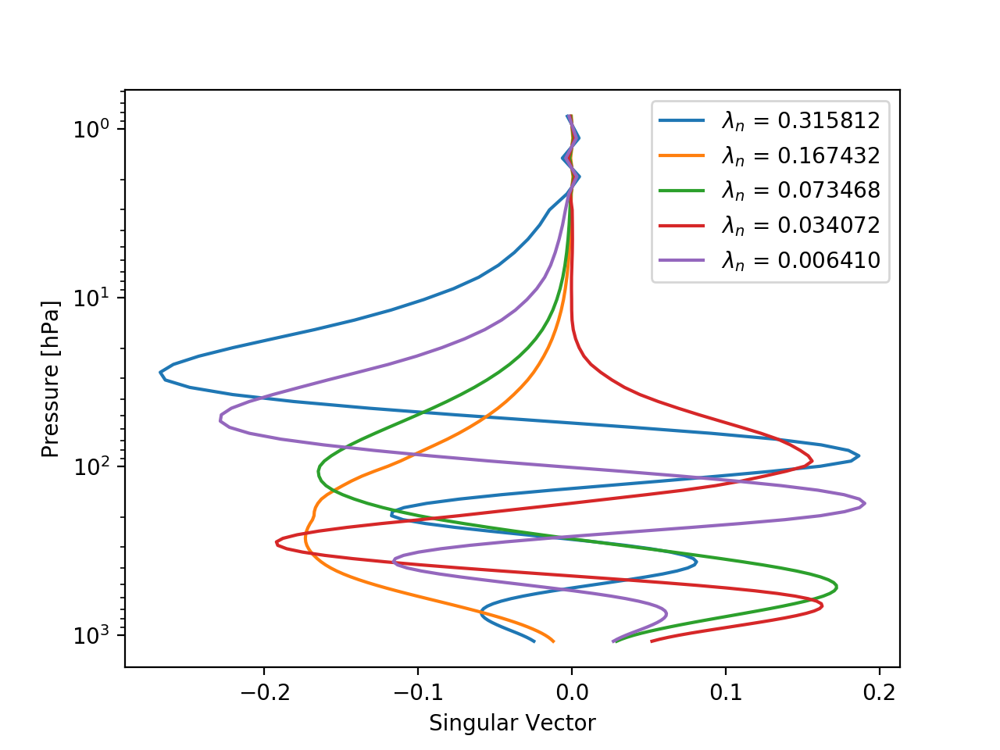

# Short Description
This tutorial provides a very short example how the K-matrix result computed with the CRTM in the `CRTM_tutorial/K-Matrix_test` folder can be further processed.
The aim of the test case here is to compute and plot the **singular values** and **singular vectors** of the **K-matrix** for further analysis.
Such a decomposition of the matrix can be used to e.g. identify the *null space* and the *row space* of the sounding measurement.

# Code explanation
The singular value decomposition of the Jacobian has the following form:
``` Fortran
K = U * S * V'
```
where `K` is the Jacobian, `S` is the diagonal matrix of singular values, and `U` and `V` are the matrices composed of the left and right singular vectors respectively. To start, the Fortran code loads the Jacobian from `output_K.txt`, which contains the results from the previous run in `../K-Matrix_test`:
```Fortran
! Read in the K-Matrix for all AMSU-A channels:
OPEN(66,FILE='output_K.txt',STATUS='OLD')
READ(66,*) K
CLOSE(66)
```
The Jacobian can be conveniently stored as a regular Fortran array of type `REAL`:
```Fortran
INTEGER(KIND=8), PARAMETER :: M = 92 ! Atmospheric pressure levels
INTEGER(KIND=8), PARAMETER :: N = 5 ! AMSU-A channels
REAL(KIND=8), DIMENSION(M,N) :: K    ! CRTM K-Matrix
```
Subsequently, the `DGESVD` `SUBROUTINE` from LAPACK is used to compute the singular value decomposition of `K`:
```Fortran
CALL DGESVD(jobu,jobv,M,N,K,lda,sdiag,u,ldu,v,ldv, work,lwork,info)
IF( info /= 0 ) THEN
  WRITE(*,*) 'Singular value decomposition failed!'
END IF
```
Finally, the singular values are written to `SVD_results.txt` and the singular vectors to `Singular_vectors.txt`.

# Running the test case
Below is a walkthrough for all the steps of this tutorial case.

## Compilation
In order to compile the test, again simply type 
```bash
make 
```
in this folder.

### If something goes wrong...
The `makefile` expects the CRTM installation to reside in `/usr/local/crtm_v2.3.0/`.
If this is not the case for installation, you need to modify the CRTM path in the makefile accordingly.

## Running the computations
This folder contains a shell script that will perform all necessary operations. You can call it with the following command:
```bash
./run.sh
```
This will produce two output text files:
- `SVD_result.txt`
-`Singular_vectors.txt`

## Plotting the results
In order to plot the resuts, simply type:
```bash
python plot.py
```
This python script will read both `*.txt` output files and produce the following plot of the singular vectors of the input Jacobian matrix with the corresponding singular *values* in the plot legend:

Note the *zigzag* oscillations of the singular values at low pressure values (top). These are caused by the truncation of the smooth Jacobian profiles near the top of the atmosphere in the preceding computations in `../K-Matrix_test`.
