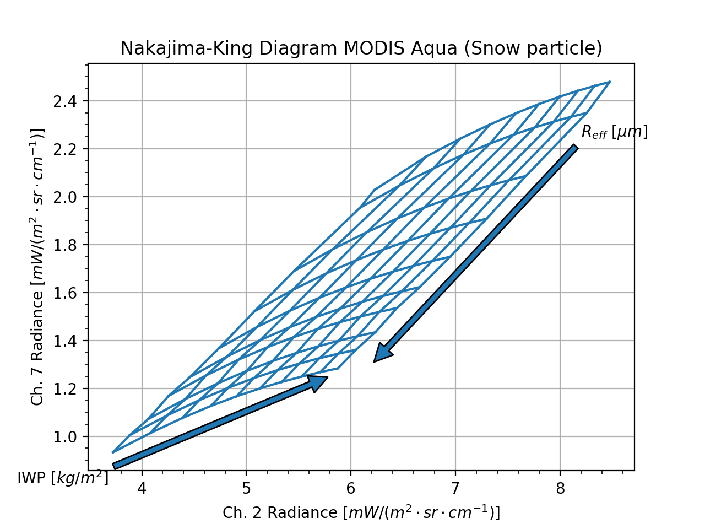

# Short Description
This is a tutorial on how to use the CRTM `Forward` solver to compute a database for the bispectral retrieval of cloud optical thickness and particle effective radius for a `SNOW`-type cloud in the CRTM.
To this end, a two-dimensional mapping is created for the MODIS-Aqua instrument, channels 2 and 7.
# Code Description
First, calling CRTM procedures requires loading the CRTM module:
```Fortran
USE CRTM_Module
```


# Running the test case
Below is a walkthrough for all the steps of this tutorial case.

## Compilation
In order to compile the test, simply type 
```
make 
```
in this folder.

### If something goes wrong...
The `makefile` expects the CRTM installation to reside in `/usr/local/crtm_v2.3.0/`.
If this is not the case for installation, you need to modify the CRTM path in the makefile accordingly.

## Running the computations
If the compilation was successful, an executable called `NK.x` is created.
To run the computations, simply type:
```
./NK.x
```
You should see the following output in the terminal:
```Fortran
        .
        .
        .
      Profile 100 output for v.modis_aqua

    Channel 2 results
RTSolution OBJECT
  Sensor Id                     : v.modis_aqua
  WMO Satellite Id              : 784
  WMO Sensor Id                 : 389
  Channel                       : 2
  RT Algorithm Name             : ADA                 
  Scattering Optical Depth      :  2.772730E+02
  Surface Emissivity            :  0.000000E+00
  Surface Reflectivity          :  0.000000E+00
  Up Radiance                   :  0.000000E+00
  Down Radiance                 :  0.000000E+00
  Down Solar Radiance           :  0.000000E+00
  Surface Planck Radiance       :  0.000000E+00
  Total cloud cover             :  0.000000E+00
  Radiance (clear)              :  0.000000E+00
  Brightness Temperature (clear):  0.000000E+00
  Radiance                      :  5.875433E+00
  Brightness Temperature        :  1.119890E+03

    Channel 7 results
RTSolution OBJECT
  Sensor Id                     : v.modis_aqua
  WMO Satellite Id              : 784
  WMO Sensor Id                 : 389
  Channel                       : 7
  RT Algorithm Name             : ADA                 
  Scattering Optical Depth      :  1.338794E+02
  Surface Emissivity            :  0.000000E+00
  Surface Reflectivity          :  0.000000E+00
  Up Radiance                   :  0.000000E+00
  Down Radiance                 :  0.000000E+00
  Down Solar Radiance           :  0.000000E+00
  Surface Planck Radiance       :  0.000000E+00
  Total cloud cover             :  0.000000E+00
  Radiance (clear)              :  0.000000E+00
  Brightness Temperature (clear):  0.000000E+00
  Radiance                      :  1.283064E+00
  Brightness Temperature        :  4.937087E+02

    Destroying the CRTM...
The program has been successfully completed.
```

## Plotting the results
In order to plot the resuts, simply type:
```
python grid.py
```
This python script will read the `output.txt` output file and produce the following plot of the mapping between radiance space and cloud physical parameters:

